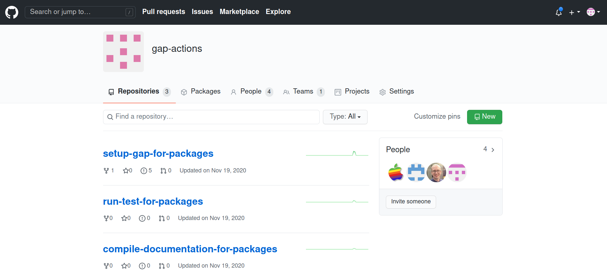

## Gap actions

Sergio Siccha

<small>
TU Kaiserslautern
</small>

<small>Created with [reveal.js](https://revealjs.com)</small>

---

TODO:
- screenshot of marketplace?
- host this on github
- clean up the actions on pkg/actions

---




---

Documentation artifacts:

[gap-packages/recog](https://github.com/gap-packages/recog/)

---

## Setup action

[gap-actions/setup-gap-for-packages](https://github.com/gap-actions/setup-gap-for-packages)

---

### A minimal CI file
```yaml
name: CI

on:
  - push
  - pull_request

...
```

---

### A minimal CI file
```yaml
jobs:
  # The CI test job
  test:
    name: CI test
    runs-on: ubuntu-latest

    steps:
      - uses: actions/checkout@v2
      - uses: gap-actions/setup-gap-for-packages@v1
      - uses: gap-actions/run-test-for-packages@v1
```

---

### Only PR and push master

---

### A documentation job
```yaml
jobs:
  ...

  # The documentation job
  manual:
    name: Build manuals
    runs-on: ubuntu-latest

    steps:
      - uses: actions/checkout@v2
      - uses: gap-actions/setup-gap-for-packages@v1
      - uses: gap-actions/compile-documentation-for-packages@v1
        with:
          use-latex: 'true'
      - name: "Upload documentation"
        uses: actions/upload-artifact@v1
        with:
          name: manual
          path: ./doc/manual.pdf
```


---

### Some options
```
TODO
```

---

### Badges
`README.md`
```
TODO
```

---


<!-- .slide: style="text-align: left;"> -->
### Exercise:

Add a CI action to a GAP package which uses
```
gap-actions/setup-gap-for-packages@v1
```

TODO: You can fork
[ssiccha/TestActionPackage](https://github.com/ssiccha/TestActionPackage).


---

## Setup code coverage

---

## Slide 2

```[1-2|3|4]
PseudoCode(x);
PseudoCode(x);
PseudoCode(x);
PseudoCode(x);
```

---

<small>
Background image:

Florian Maderebner,
[Two Man Hiking on Snow Mountain](https://www.pexels.com/photo/two-man-hiking-on-snow-mountain-869258/)
(Pexel license)
</small>
